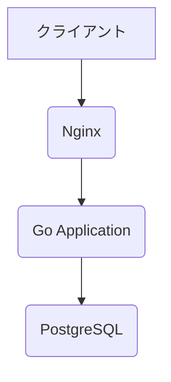

# SQLインジェクション脆弱性実験

---

## 実験概要

- **目的**: Goで作成したWebアプリケーションに存在するSQLインジェクション脆弱性を`sqlmap`を用いて攻撃し、その影響と対策を理解する。
- **対象**: 今回作成したGoアプリケーション
- **ツール**: `sqlmap`

---

## 環境構築

- **OS**: Ubuntu Server
- **Webサーバ**: Nginx
- **アプリケーション**: Go
- **データベース**: PostgreSQL



---

## 実験手順

1.  **環境構築**: Ubuntu Server上にNginx, Go, PostgreSQLをセットアップする。
2.  **アプリケーションのデプロイ**: 作成したGoアプリケーションをデプロイし、Nginxと連携させる。
3.  **脆弱性の確認**: `sqlmap` を使用して、ログインフォームなどからSQLインジェクション攻撃を試みる。
4.  **結果の分析**: `sqlmap` によって得られた情報（DB名、テーブル、データなど）を確認する。

---

## sqlmapの実行コマンド例

```bash
# ログインページに対してPOSTリクエストで検査
sqlmap -u "http://<対象のIPアドレス>/login" --data="username=test&password=test" --risk=3 --level=5 -p username --dbms=postgresql

# データベースの情報を取得
sqlmap -u "..." --dbs

# テーブル一覧を取得
sqlmap -u "..." -D <DB名> --tables

# カラム一覧を取得
sqlmap -u "..." -D <DB名> -T <テーブル名> --columns

# データをダンプ
sqlmap -u "..." -D <DB名> -T <テーブル名> -C <カラム名> --dump
```

---

## 結果

ここに`sqlmap`の実行結果や、それによって明らかになった脆弱性の詳細を記述します。

（例）

- `sqlmap`により、`users`テーブルの存在が確認された。
- ユーザ名とパスワード（ハッシュ化されている場合はそのハッシュ値）のダンプに成功した。

---

## まとめと対策

- **まとめ**: 今回の実験により、パラメータのエスケープ処理が不十分な場合、容易にSQLインジェクション攻撃が成功することが確認できた。
- **対策**:
  - **プリペアドステートメントの使用**: SQLクエリを組み立てる際に、プレースホルダを使用する。
  - **入力値のバリデーション**: ユーザからの入力が想定された形式・型であることを常に検証する。
  - **WAFの導入**: Web Application Firewallを導入し、不正なリクエストを検知・ブロックする。
