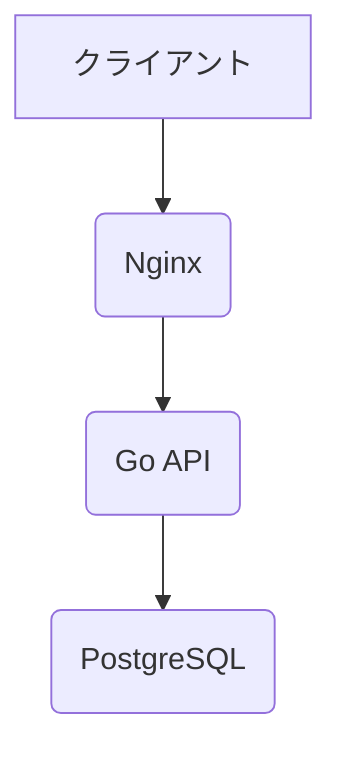

# SQLインジェクション実験レポート

## Go × PostgreSQL アプリケーションにおける脆弱性検証

石井晴大

---

## 1. 実験環境構成

- **OS**: Ubuntu Server 22.04
- **Webサーバ**: Nginx (リバースプロキシ)
- **アプリケーション**: Go (自作API)
- **データベース**: PostgreSQL
- **ネットワーク**: Tailscale (安全なP2P接続)

---



- Nginx経由でAPIを提供する構成
- Ubuntu Serverで環境を構築、Nginxの設定に苦労した

---

## 2. SQLMapによる脆弱性診断（事前確認）

まず、安全実装の状態で`sqlmap`を実行し、SQLインジェクションの有無を検証。

```bash
sqlmap -u "http://<対象IP>/api/login" \
  --data='{"username":"test", "password":"test"}' \
  -p username --dbms=PostgreSQL

```

---


- **想定どおり、安全**

---

## 3. アプリケーションの安全実装

`auth.go` の抜粋

```go
err := db.QueryRow("SELECT password_hash FROM users WHERE username=$1", u.Username).Scan(&hashed)
```

- Goの`database/sql`パッケージ + **プリペアドステートメント**
- ユーザー入力はSQLに埋め込まれず、バインドされるだけ

---

## 4. エスケープ処理を外した脆弱な実装と診断

意図的にエスケープ処理を外した例

```go
query := fmt.Sprintf("SELECT password_hash FROM users WHERE username='%s'", username)
err := db.QueryRow(query).Scan(&hashed)
```

この状態で再度`sqlmap`実行。

```bash
sqlmap -u "http://<対象IP>/api/login" \
  --data='{"username":"' OR '1'='1", "password":"test"}' \
  -p username --dbms=PostgreSQL
```

- **想定される結果**: 脆弱性検出・データベース情報の漏洩

---

## 実行結果


---

## 5. 実際の改変手順とスクリーンショット

- **`auth.go`** の元の安全実装

```go
err := db.QueryRow("SELECT password_hash FROM users WHERE username=$1", u.Username).Scan(&hashed)
```

- **脆弱化後のコード**

```go
query := fmt.Sprintf("SELECT password_hash FROM users WHERE username='%s'", u.Username)
err := db.QueryRow(query).Scan(&hashed)
```

<!-- スクリーンショット挿入例 -->

<!--  -->

---

## 6. SQLMapについて

- オープンソースのSQLインジェクション自動検査ツール
- 主な機能:

  - インジェクションポイントの自動探索
  - データベース情報の取得
  - テーブル・カラム列挙、データ抽出

- CLIベースで多様なオプションあり

---

## 7. 実験結果

- **安全実装**では、SQLインジェクションは成功しなかった
- **脆弱な実装**では、SQLMapが脆弱性を検出し、情報漏洩が可能だった

---

## ご清聴ありがとうございました

---
